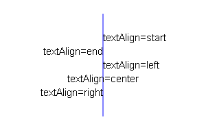
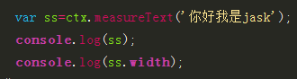
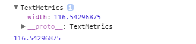
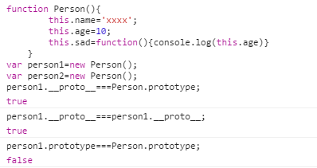

#一、canvas简介

##1、1  什么是canvas？
+ html5提供的新标签，IE9以上才支持该标签

```
    <canvas></canvas>

```

+ canvas是一个矩形的画布，可以用JS在上面绘画，能精确到一个像素
+ canvas本身不具备绘图功能
+ canvas拥有多种绘制路径、矩形、圆形、字符以及添加图像方法
+ HTML5之前的web页面只用一些固定样式的标签：比如div、p、等

##1、2  canvas的应用领域
+ 1、游戏：canvas在基于Web的图像显示方面比Flash更加立体、更加精巧，canvas游戏在流畅度和跨平台方面更牛。 
+ 2、可视化数据，数据图表，如：[百度echarts](http://echarts.baidu.com/)
+ 3、广告：Flash曾经辉煌的时代，智能手机还未曾出现。现在以及未来的智能机时代，HTML5技术能够在banner广告上发挥巨大作用，用Canvas实现动态的广告效果再合适不过。
+ 4、未来=> 模拟器：无论从视觉效果还是核心功能方面来说，模拟器产品可以完全由JavaScript来实现。
+ 5、未来=> 远程计算机控制：Canvas可以让开发者更好地实现基于Web的数据传输，构建一个完美的可视化控制界面。
+ 6、未来=> 图形编辑器：Photoshop图形编辑器将能够100%基于Web实现。
+ 7、其他可嵌入网站的内容(多用于活动页面、特效)：类似图表、音频、视频，还有许多元素能够更好地与Web融合，并且不需要任何插件。
+ 8、完整的canvas移动化应用

##1、3  要求 
+ 必须会做基本的用canvas绘制的特效页面
+ 会用canvas做一些简单的广告、活动页面

##1、4  canvas标准
+ 最新标准：http://www.w3.org/TR/2dcontext/
+ 稳定版本的标准：http://www.w3.org/TR/2013/CR-2dcontext-20130806/
+ 目前来说，标准还在完善中。先用早期的api足够完成所有的应用

#二 canvas绘图基础
##2、1 canvas标签语法和属性
+ 标签名canvas，需要进行闭合。就是一普通的html标签
+ 可以设置width和height属性，但是属性值单位必须是px，否则忽略
+ width和hegiht：默认300*150像素
+ 注意：
 + 不要用CSS控制它的宽和高,会走出图片拉伸，
 + 重新设置canvas标签的宽高属性会让画布擦除所有的内容
 + 可以给canvas画布设置背景色

##2、2 浏览器不兼容**
+ ie9以上才支持canvas, 其他chrome、ff、苹果浏览器等都支持
+ 只要浏览器兼容canvas，那么就会支持绝大部分api(个别最新api除外)
+ 移动端的兼容情况非常理想，基本上随便使用
+ 2d的支持的都非常好，3d（webgl）ie11才支持，其他都支持
+ 如果浏览器不兼容，最好进行友好***提示***
+ 浏览器不兼容，可以使用flash等手段进行***优雅降级***

###2、3 canvas的上下文context对象***
+ 上下文：上知天文，下知地理。是所有的绘制操作api的入口或者集合
+ Canvas自身无法绘制任何内容。Canvas的绘图是使用JavaScript操作的
+ Context对象就是JavaScript操作Canvas的接口。 *使用[CanvasElement].getContext(‘2d’)来获取2D绘图上下文
+ getContext("2d") 对象是内建的 HTML5 对象，拥有多种绘制路径、矩形、圆形、字符以及添加图像的方法

```javascript
	
	//获得画布
	var canvas  = document.getElementById( 'cavsElem' ); 
	var ctx = canvas.getContext( '2d' );//注意：2d小写
	
```
###2、4 canvas基本的绘制路径***
####2、4、1 canvas坐标系
+ 
+ 鼠标悬停查看坐标系(相对坐标)demo03.html

####2、4、2  设置绘制起点moveTo(x,y)
+ 语法：ctx.moveTo(x, y);
+ 解释：设置上下文绘制路径的起点。相当于移动画笔到某个位置
+ 参数：x,y 都是相对于 canvas盒子的最左上角
+ 注意：**绘制线段前必须先设置起点，不然绘制无效。**

####2、4、3  绘制直线lineTo
+ 语法：ctx.lineTo(x, y);
+ 解释：从x,y的位置绘制一条直线到起点或者上一个线头点
+ 参数：x,y 线头点坐标
+ 绘制五子棋棋盘如：demo02.html
+ 绘制简单的折线图表如：demo03.html

####2、4、4 路径的开始和闭合
+ 开始路径：ctx.beginPath();
+ 闭合路径：ctx.closePath();
+ 解释：如果复杂路径绘制，必须使用路径开始和结束。闭合路径会自动把最后的线头和开始的线头连在一起
+ beginPath: 核心的作用是将 不同绘制的形状进行隔离，每次执行此方法，表示重新绘制一个路径,跟之前的绘制的墨迹可以进行分开样式设置和管理

#### 2、4、5  描边stroke()
+ 语法：ctx.stroke();
+ 解释：根据路径绘制线。路径只是草稿，真正绘制线必须执行stroke

#### 2、4、6  绘制的基本步骤
+ 第一步获得canvas元素=>canvasElem=document.getElementById('cavsElem');或者其他API
+ 第二步：获得上下文 =>canvasElem.getContext('2d');
+ 第三步：开始路径规划 =>ctx.beginPath()
+ 第四步：移动起始点 =>ctx.moveTo(x, y)
+ 第五步：绘制线(矩形、圆形、图片...) =>ctx.lineTo(x, y)
+ 第六步：闭合路径 =>ctx.closePath();
+ 第七步：绘制描边 =>ctx.stroke();

```
    html部分：
        <canvas id="cavsElem">
            你的浏览器不支持canvas，请升级浏览器
        </canvas>

    javascript部分：

    //===============基本绘制api====================
    //获得画布
    var canvas = document.querySelector('#cavsElem');
    var ctx = canvas.getContext('2d');  //获得上下文

    canvas.width = 900;     //设置标签的属性宽高
    canvas.height = 600;    //千万不要用 canvas.style.height
    canvas.style.border = "1px solid #000";

    //绘制三角形
    ctx.beginPath();        //开始路径
    ctx.moveTo(100,100);    //三角形，左顶点
    ctx.lineTo(300, 100);   //右顶点
    ctx.lineTo(300, 300);   //底部的点
    ctx.closePath();        //结束路径
    ctx.stroke();           //描边路径
```
####  2、4、7 填充 fill()
+ 语法：ctx.fill(); 
+ 解释：填充，是将闭合的路径的内容填充具体的颜色。默认黑色。
+ 如demo01.html

####  2、4、8 快速创建矩形的方法rect()
+ 语法：ctx.rect(x, y, width, height);
+ 解释：x, y是矩形左上角坐标， width和height都是以像素计
+ rect方法只是规划了矩形的路径，并没有填充和描边。
+ 如demo05.html

#### 2、4、9 快速创建描边矩形和填充矩形strokeRect()
+ 语法： ctx.strokeRect(x, y, width, height);
+ 语法：ctx.fillRect(x, y, width, height);
+ 如demo05.html

#### 2、4、10清除矩形 clearRect()
+ 语法：ctx.clearRect(x, y, width, hegiht);
+ 解释：清除某个矩形内的绘制的内容，相当于橡皮擦
+ 如demo05.html

###2、5 绘制圆形arc(),arc() 方法创建弧/曲线（用于创建圆或部分圆）
+ 语法：ctx.arc(x,y,r,sAngle,eAngle,counterclockwise);
+ x,y：圆心坐标
+ r：半径大小
+ sAngle:绘制开始的角度。 圆心到最右边点是0度，顺时针方向弧度增大
+ eAngel:结束的角度，注意是弧度。π
+ counterclockwise：是否是逆时针。true是逆时针，false：顺时针
+ 弧度和角度的转换公式： rad = deg*Math.PI/180;如：45度=45*Math.PI/180
+ 在Math提供的方法中sin、cos等都使用的弧度 

+ 绘制弧形如：demo06.html
+ 绘制饼状图如：demo07.html

###2、5、1 javascript中的数学计算Math.sin(弧度)和Math.cos(弧度)
+ 几何数学中是实际的度数:sin48=x/y,x=sin48*y
+ JS中是需要转换为弧度去计算，
+ 例：求下图中A点的坐标，已知A点距离原点的距离：r+20,以及A点与水平线的夹角为30度，canvas中水平线往上为负的度数
+ 

### 2、6 绘制文字
+ 把之前绘制的饼状图继续绘制指定的文字，如：demo09.html
+ font 设置或返回文本内容的当前字体属性,如：ctx.font = "20px '微软雅黑'";
+ textAlign 设置或返回文本内容的当前对齐方式：ctx.textAlign = 'left';
	+ start : 默认。文本在指定的位置开始
	+ end : 文本在指定的位置结束
	+ center: 文本的中心被放置在指定的位置
	+ left : 文本左对齐
	+ right : 文本右对齐
+ 
+ textBaseline 设置或返回在绘制文本时使用的当前文本基线
 + ctx.textBaseline = 'top';
 + alphabetic ： 默认。文本基线是普通的字母基线
 + top ： 文本基线是 em 方框的顶端
 + hanging ： 文本基线是悬挂基线
 + middle ： 文本基线是 em 方框的正中
 + ideographic： 文本基线是em基线
 + bottom ： 文本基线是 em 方框的底端
+ 

####2、6、1  绘制文字的方法
+ ctx.fillText()//在画布上绘制“被填充的”文本,实心
+ ctx.strokeText()//在画布上绘制文本（无填充），空心
+ ctx.measureText()//返回包含指定文本宽度的对象
 + 如下ctx.measure('string')返回TextMetrics对象，TextMetrics的width属性就是string的宽度
 + 
 + 

### 2、7  绘制图片***
+ context.drawImage(img,x,y,width,height); 
+ 参数说明：width 绘制图片的宽度，  height：绘制图片的高度
+ 如果指定宽高，最好成比例，不然图片会被拉伸</em>，
+ width/height=setWidth/setHeight
+ setHeight=setWidth*height/width；  //等比
+ 等比公式：toH = Height*toW/Width; //等比 
+ 设置高 = 原高度 * 设置宽/ 原宽度;如demo10.html
#### 2.7.0  javascript中创建img对象
+ 1：var img = document.getElementById("imgId");
+ 2:

```javascript

	var img = new Image();//这个就是 img标签的dom对象
    img.src = "imgs/arc.gif";
    img.alt = "文本信息";
    img.onload = function() {
        //图片加载完成后，执行此方法
    }


```

###  2、7、1  图片裁剪，并在画布上单位被裁剪的部分
+ context.drawImage(img,sx,sy,swidth,sheight,x,y,width,height);
+ sx,sy 裁剪的左上角坐标，
+ swidth：裁剪图片的宽度。 sheight:裁剪的高度
+ x,y,width,height,将要绘制在画布上的的位置的左边以及绘制出来的宽高(其实同上)
+ 面向过程版本：绘制动画帧如：demo12.html
+ 面向过程按钮控制：动画帧demo13.html

###JS中创建对象的方式!!重要****
+ 1:JSON格式的方式（key:value）javascript Object Notation
+ 缺点：不能把JSON对象当成一个模板，进行new操作

```javascript

	var obj1={
		name:'xxx',
		age:'xxx',
		sad:function(){}
	}

```

+ 2：通过new object

```javascript

	var obj2=new Object();
	obj2.name='xxx';
	obj2.age=20;
	obj2.say=function(){}

```

+ 3:通过构造函数的方式,优点：可以当做模板

```javascript
	
	//构造函数Person(),默认return this
	function Person(){
		this.name='xxxx';
		this.age=10;
		this.sad=function(){console.log(this.age)}
		this.speak=function(){
            console.log('I am '+this.name+' '+'今年 :'+this.age);
        }
	}
	var person1=new Person();
	person1.age=20;
	person1.sad();//20
	//注意 new操作符 :的内部原理
		1：创建一个空对象
		2：把this指向到这个空对象
		3：把空对象的内部原型(proto)指向构造函数的原型(prototype)对象
		4：当前构造函数执行完成后，如果没有return的话，就会把当前的空对象返回，一般都没有return
	//注意 new操作符原理：执行的时候类似在构造函数Person()内部，过程可以如下去理解，实际不是！！
	function Person(){
		var tt={};
		this=tt;
		tt.__proto__=Person.prototype;
		this.name='xxxx';
		this.age=10;
		this.sad=function(){...}
		return tt;
	}
	//prototype只有函数才有的原型
	//__proto__所有的对象都有的
	person1.__proto__===Person.prototype;//true
	person1.prototype===Person.prototype;//false
	person1===person2//false

	var person2=new Person();
	//可以把所有实例对象person1、person2...的公用方法封装到构造函数的的原型里面去,就可以减少空间
	Person.prototype.speak=function(){
        console.log('I am '+this.name+' '+'今年 :'+this.age);
    }
	person2.name='person2';
	person2.age=100;
	person2.sad();//100
	person2.speak();//I am person2 今年 :100

```

+ 
+ 3.1  上面代码的升级版本

```javascript

	function Person(name,age){
        this.name=name;
        this.age=age;
    }
    //1 实例对象person1和person2的公用方法 speak
	Person.prototype.said=function(){
		console.log('This is '+this.name);
    }
    Person.prototype.speak=function(){
       console.log('I am '+this.name+'，今年 '+this.age);
    }
    var person1=new Person({name:'马云',age:40});
    var person2=new Person({name:'王健林',age:50});
    person1.said();//This is 马云
    person2.said();//This is 王健林
    person1.speak();//I am 马云，今年 40
    person2.speak();//I am 王健林，今年 50

```

+ 3.2  上面代码的再次升级版本

```javascript

	function Person(option){
        this.name=option.name;
        this.age=option.age;
    }
	Person.prototype.said=function(){
		console.log('This is '+this.name);
    }
    Person.prototype.speak=function(){
       console.log('I am '+this.name+'，今年 '+this.age);
    }
    var person1=new Person({name:'马云',age:40});
    var person2=new Person({name:'王健林',age:50});
    person1.said();//This is 马云
    person2.said();//This is 王健林
    person1.speak();//I am 马云，今年 40
    person2.speak();//I am 王健林，今年 50

```

+ 3.3  上面代码的再再次升级版本

```javascript

	function Person(option){
        this.init(option);
    }
   	//重新设定原型
    Person.prototype={
        init:function(option){
            this.name=option.name||'';
            this.age=option.age||'';
        },
		said:function(){console.log('This is '+this.name);},
        speak:function(){
            console.log('I am '+this.name+'，今年 '+this.age);
        }
    }
    var person1=new Person({name:'马云',age:40});
    var person2=new Person({name:'王健林',age:50});
    person1.said();//This is 马云
    person2.said();//This is 王健林
    person1.speak();//I am 马云，今年 40
    person2.speak();//I am 王健林，今年 50

```

+ 总结：由于实例对象的内部原型proto都指向构造函数的原型prototype，所有的实例对象的公用属性和方法封装到构造函数的原型里面去
+ 如果实例对象设置一个跟原型对象相同属性的值，会自动添加一个实例对象自己的属性，读取属性时候先找自己的，没有的话再找原型的属性
+ 如：proto.html
+ 面向对象的使用如：prototype.html
###函数的四种调用模式和其中的this指向

```javascript
	
	//第一种：函数执行模式
        function add(a,b){
            console.log(this);
            return a+b;
        }
        add(10,20)//this===window

        //第二种：对象方法的调用模式
        var obj={
            name:'aaa',
            age:20,
            said:function(){
                console.log(this);
            }
        }
        obj.said();//this===obj，此处this指代被调用者
        //所有的事件响应方法都是  对象方法调用模式


        //第三种：构造器的调用模式
        function School(){
            this.said=function(){
                console.log(this);
            }
        }
        var nanj=new School();
        nanj.said();//对象调用自己的方法，this===nanj


        //第四种：call和apply调用模式
        function change(a,b){
            this.detial=a*b;
            console.log(this);
        }
        var p={};
        change.call(p,4,5);//此处的this===p
        console.log(p.detial);
        var q=[];
        change.call(q,5,10)//this===q
        console.log(q.detial);

        //apply和call一样的用法，只不过apply第二个参数用数组进行传递
        var arr=[];
        change.apply(arr,[10,10]);//this===arr
        console.log(arr.detial);

        var str={};
        change.apply(str,[20,20]);//this===str
        console.log(str.detial);

```

+ [proto与prototype区别-知乎](https://www.zhihu.com/question/34183746/answer/58068402)

#三、canvas进阶
##3.1 设置填充和描边的颜色
+ fillStyle : 设置或返回用于填充绘画的颜色
+ strokeStyle: 设置或返回用于笔触的颜色
+ 以上两个值都可以接受颜色名,16进制数据，rgb值，甚至rgba. 一般先进行设置样式然后进行绘制

```javascript

	ctx.strokeStyle = "red";      
	ctx.strokeStyle = "#ccc";      
	ctx.strokeStyle = "rgb(255,0,0)";      
	ctx.strokeStyle = "rgba(255,0,0,6)";

```

##3.2  设置阴影(了解，少用，性能差)
+ 类比于CSS3的阴影
+ shadowColor ： 设置或返回用于阴影的颜色
+ shadowBlur ： 设置或返回用于阴影的模糊级别,大于1的正整数，数值越高，模糊程度越大
+ shadowOffsetX： 设置或返回阴影距形状的水平距离
+ shadowOffsetY： 设置或返回阴影距形状的垂直距离
+ 设置png图片的阴影，图片透明部分不会被投影
+ 如:demo16.html

``` javascript

	ctx.fillStyle = "rgba(255,0,0, .9)"
    ctx.shadowColor = "teal";
    ctx.shadowBlur = 10;
    ctx.shadowOffsetX = 10;
    ctx.shadowOffsetY = 10;
    ctx.fillRect(100, 100, 100, 100);

```

##3.3   复杂样式，创建线性渐变的样式(了解)
+ 一般不用，都是用图片代替，canvas绘制图片效率更高
+ 线性渐变可以用于 矩形、圆形、文字等颜色样式
+ 线性渐变是一个对象
+ 语法：ctx.createLinearGradient(x0,y0,x1,y1); //参数：x0,y0起始坐标，x1,y1结束坐标
+ 如:demo16.html

```javascript

	//创建线性渐变的对象，
    var grd=ctx.createLinearGradient(0,0,170,0);
	//添加一个渐变颜色，第一个参数介于 0.0 与 1.0 之间的值，
	//表示渐变中开始与结束之间的位置。
    grd.addColorStop(0,"black");  
    grd.addColorStop(1,"white");  //添加一个渐变颜色
    ctx.fillStyle =grd;           //关键点，把渐变设置到 填充的样式

	
```
##3.4  设置圆形的线性渐变(了解)
+ 创建放射状/圆形渐变对象。可以填充文本、形状等
+ context.createRadialGradient(x0,y0,r0,x1,y1,r1);
+ radial 半径的；放射状的；光线的；光线状的 英 ['reɪdɪəl] 美 ['redɪəl]
+ x0: 渐变的开始圆的 x 坐标
+ y0: 渐变的开始圆的 y 坐标
+ r0: 开始圆的半径
+ x1: 渐变的结束圆的 x 坐标
+ y1: 渐变的结束圆的 y 坐标
+ r1: 结束圆的半径
+ demo16.html
## 3.5  绘制背景图(了解)
+ ctx.createPattern(img,repeat) 方法在指定的方向内重复指定的元素了解
+ pattern：n. 模式；图案；样品 英 ['pæt(ə)n] 美 ['pætɚn]
+ 第一参数：设置平铺背景的图片，第二个背景平铺的方式
+ image ： 规定要使用的图片、画布或视频元素
+ repeat ： 默认。该模式在水平和垂直方向重复
+ repeat-x ： 该模式只在水平方向重复
+ repeat-y ： 该模式只在垂直方向重复
+ no-repeat： 该模式只显示一次（不重复）

```javascript
	
	var ctx=c.getContext("2d");
    var img=document.getElementById("lamp");
    var pat=ctx.createPattern(img,"repeat");
    ctx.rect(0,0,150,100);
    ctx.fillStyle=pat;//  把背景图设置给填充的样式
    ctx.fill();

```
##3.6   变换***
###3.6.1 缩放(***)
+ scale() 方法缩放当前绘图，更大或更小
+ 语法：context.scale(scalewidth,scaleheight)
+ scalewidth : 缩放当前绘图的宽度 (1=100%, 0.5=50%, 2=200%, 依次类推)
+ scaleheight : 缩放当前绘图的高度 (1=100%, 0.5=50%, 2=200%, etc.) +注意：缩放的是整个画布，缩放后，继续绘制的图形会被放大或缩小。
+ 如：demo17.html

###3.6.2  位移(***)
+ ctx.translate(x,y) 方法重新映射画布上的 (0,0) 位置
+ x： 添加到水平坐标（x）上的值
+ y： 添加到垂直坐标（y）上的值
+ 发生位移后，相当于把画布的0,0坐标 更换到新的x,y的位置，所有绘制的新元素都被影响。
+ 位移画布一般配合缩放和旋转等。
+ 如：demo17.html

###3.6.3  旋转(***)
+ context.rotate(angle); 方法旋转当前的绘图
+ 注意参数是弧度（PI）
+ 如需将角度转换为弧度，请使用 degrees*Math.PI/180 公式进行计算。
+ demo17.html

##3.7 绘制环境的保存和还原（***）
+ ctx.save() 保存当前环境的状态，可以把当前绘制环境进行保存到缓存中
+ ctx.restore() 返回之前保存过的路径状态和属性，获取最近缓存的ctx
+ 一般配合位移画布使用
+ 如：demo17.html

## 3.8 设置绘制环境的透明图(了解)
+ context.globalAlpha=number;
+ number:透明值。必须介于 0.0（完全透明） 与 1.0（不透明） 之间
+ 设置透明度是全局的透明度的样式。注意是全局的

### 封装绘制矩形的原型方式,以及添加动画*****

```javascript

	/*
	* 封装属性：
	* 1: x,y,w,h,fillStyle,strokeStyle,rotation,opacity
	* 封装行为
	* 2:render
	*
	*
	* */
	
	function ItcastRect(option){
	    this._init(option);
	}
	ItcastRect.prototype={
	    _init:function(option){
	        this.x=option.x||0;
	        this.y=option.y||0;
	        this.w=option.w||0;
	        this.h=option.h||0;
	        this.rotation=option.rotation||0;
	        this.opacity=option.opacity===0?0:option.opacity||1;
	
	        this.scaleX=option.scaleX||1;
	        this.scaleY=option.scaleY||1;
	
	        this.strokeStyle=option.strokeStyle||'green';
	        this.fillStyle=option.fillStyle||'red';
	
	    },
	    render:function(ctx){
	        ctx.save();//保存当前的状态
	
	        ctx.beginPath();
	        ctx.translate(this.x,this.y);
	        ctx.rotate(this.rotation*Math.PI/180);
	        ctx.globalAlpha=this.opacity;
	        ctx.scale(this.scaleX,this.scaleY);
	        ctx.rect(0,0,this.w,this.h);
	        ctx.fillStyle=this.fillStyle;
	        ctx.fill();
	
	        ctx.strokeStyle=this.strokeStyle;
	        ctx.stroke();
	
	        ctx.restore();//回归到最初的原始状态
	    }
	}

```

+ 如demo18.html

###封装绘制圆形的原型方式，以及添加动画*****
```javasript
	
	/*
	* ctx.arc(x,y,r,startAngle,andAngle,counterclockwise)
	 x,y圆心的左边
	 r圆的半径
	 startAngle，andAngle开始和结束的角度，注意是弧度π,
	 JS里是：Math.PI
	 counterclockwise：是否是逆时针。true是逆时针，false：顺时针
	 弧度和角度的转换方式
	 180度=Math.PI
	 如：60度 ：60*Math.PI / 180
	* */
	function ItcastArc(option){
	    this._init(option);
	}
	ItcastArc.prototype={
	    _init:function(option){
	        option=option||{};
	        // 如果传入了0就是0，不是0就是option.x,或者不传就是100
	        this.x=option.x===0?0:option.x||100;
	        this.y=option.y===0?0:option.y||100;
	        this.r=option.r||50;
	        this.sAngle=option.sAngle===0?0:option.sAngle||0;
	        this.eAngle=option.eAngle===0?0:option.eAngle||0;
	        this.sAngle=this.sAngle*Math.PI/180;
	        this.eAngle=this.eAngle*Math.PI/180;
	        this.counterclockwise=option.counterclockwise===true?true:option.counterclockwise||false;
	        //变换样式
	        this.rotation=option.rotation===0?0:option.rotation||0;
	        this.opacity=option.opacity===0?0:option.opacity||1;
	        this.scaleX=option.scaleX||1;
	        this.scaleY=option.scaleY||1;
	        this.strokeStyle=option.strokeStyle||'green';
	        this.strokeWidth = option.strokeWidth ||4;//默认描边宽度是2px
	        this.fillStyle=option.fillStyle||'red';
	    },
	    render:function(ctx){
	        ctx.save();//保存当前的状态
	
	        ctx.beginPath();
	        ctx.translate(this.x,this.y);
	
	        ctx.rotate(this.rotation*Math.PI/180);
	        ctx.globalAlpha=this.opacity;
	        ctx.scale(this.scaleX,this.scaleY);
	        ctx.fillStyle=this.fillStyle;
	        ctx.strokeStyle=this.strokeStyle;
	        ctx.moveTo(0,0);
	        ctx.arc(0,0,this.r,this.sAngle,this.eAngle,this.counterclockwise);
	        ctx.fill();
	        ctx.stroke();
	        ctx.restore();//回归到最初的原始状态
	    }
	}

```
+ 为何弧形的rotate()旋转跟矩形的旋转会不一样？？
+ scale(x,y)角度没有缩放,只是半径缩放!
+ demo19.html，

##  3.9 画布限定区域绘制(了解)
+ ctx.clip(); 方法从原始画布中剪切任意形状和尺寸
+ 一旦剪切了某个区域，则所有之后的绘图都会被限制在被剪切的区域内（不能访问画布上的其他区域）
+ 一般配合绘制环境的保存和还原。

## 3.10  画布保存64位编码内容(****)
+ 把canvas绘制的内容输出成base64的图片内容
+ 语法：canvas.toDataURL(type, encoderOptions);
+ 例如：canvas.toDataURL("image/jpg",1);
+ type，设置输出的类型，比如 image/png image/jpeg等
+ encoderOptions： 0-1之间的数字，用于标识输出图片的质量，1表示无损压缩，类型为： image/jpeg 或者image/webp才起作用
+ 如：demo20.html

```javascript

	var canvas = document.getElementById("canvas");
	var dataURL = canvas.toDataURL();
	console.log(dataURL);

	// "data:image/png;base64,iVBORw0KGgoAAAANSUhEUgAAAAUAAAAFCAYAAACNby
    // blAAAADElEQVQImWNgoBMAAABpAAFEI8ARAAAAAElFTkSuQmCC"
	
	//拿到图片的dom对象
	var img = document.querySelector("#img-demo");
	//将画布的内容给图片标签显示
	img.src = canvas.toDataURL("image/png"); 

```
## 3.11 画布渲染画布(****)
+ context.drawImage(img,x,y);
+ img参数也可以是画布，也就是把一个画布整体的渲染到另外一个画布上
+ 如：demo21.html
+ canvas优化：可以JS创建隐藏的canvas绘制完之后再绘制到显示的canvas上去，如：demo22.html

```javascript

	var canvas1 = document.querySelector('#cavsElem1');
    var canvas2 = document.querySelector('#cavsElem2');
    var ctx1 = canvas1.getContext('2d');
	var ctx2 = canvas2.getContext('2d');
	//在第一个画布上绘制矩形
    ctx1.fillRect(20, 20, 40, 40);      
    //将第一个画布整体绘制到第二个画布上
    ctx2.drawImage(canvas1, 10, 10); 

```

##3.12  线条样式(了解)
+ lineCap 设置或返回线条的结束端点(线头、线冒)样式
	+ butt ： 默认。向线条的每个末端添加平直的边缘.	翻译.：屁股；烟头；笑柄；靶垛；粗大的一端 英 [bʌt] 美 [bʌt]
	+ round ： 向线条的每个末端添加圆形线帽。
	+ square： 向线条的每个末端添加正方形线帽
+ lineJoin 设置或返回两条线相交时，所创建的拐角类型
	+ bevel: 创建斜角,	翻译. 斜角；斜面；[测] 斜角规 英 ['bev(ə)l] 美 ['bɛvl]
	+ round: 创建圆角。
	+ miter: 默认。创建尖角 
+ lineWidth 设置或返回当前的线条宽度
+ miterLimit 设置或返回最大斜接长度
	+ 意思: 斜接 英 ['maɪtə]
	+ 斜接长度指的是在两条线交汇处内角和外角之间的距离
	+ 一般用默认值：10就可以了。除非需要特别长的尖角时，使用此属性

##3.13  绘制一条二次方曲线
+ 微软的画图板中的曲线的颜色
+ quadratic：二次方的意思， 英 [kwɒ'drætɪk] 美 [kwɑ'drætɪk]
+ Curve：曲线的意思， 英 [kɜːv] 美 [kɝv]
+ 语法： context.quadraticCurveTo(cpx,cpy,x,y);
+ cpx： 贝塞尔控制点的 x 坐标
+ cpy： 贝塞尔控制点的 y 坐标
+ x ： 结束点的 x 坐标
+ y ： 结束点的 y 坐标
+ demo23.html

##3.14 绘制贝塞尔曲线(知道有)
+ 绘制一条三次贝塞尔曲线
+ 语法：context.bezierCurveTo(cp1x,cp1y,cp2x,cp2y,x,y);
+ 提示：三次贝塞尔曲线需要三个点。前两个点是用于三次贝塞尔计算中的控制点，第三个点是曲线的结束点。曲线的开始点是当前路径中最后一个点。如果路径不存在，那么请使用 beginPath() 和 moveTo() 方法来定义开始点
+ cp1x： 第一个贝塞尔控制点的 x 坐标
+ cp1y： 第一个贝塞尔控制点的 y 坐标
+ cp2x： 第二个贝塞尔控制点的 x 坐标
+ cp2y： 第二个贝塞尔控制点的 y 坐标
+ x: 结束点的 x 坐标
+ y: 结束点的 y 坐标
+ demo23.html

##3.15  了解创建两条切线的弧
+ 在画布上创建介于当前起点和两个点形成的夹角的切线之间的弧
+ 语法： context.arcTo(x1,y1,x2,y2,r); //类比：css3中的圆角
+ 例如： ctx.arcTo(240, 100, 240, 110, 40);
+ x1: 弧的端点1的 x 坐标
+ y1: 弧的端点1的 y 坐标
+ x2: 弧的端点2(终点)的 x 坐标
+ y2: 弧的端点2(终点)的 y 坐标
+ r : 弧的半径

##3.16  了解判断点是否在路径中
+ context.isPointInPath(x,y);
+ isPointInPath() 如果指定的点位于当前路径中方法返回 true；否则返回 false。
+ 判断x,y坐标的点是否在当前的路径中
#四 canvas开发库的封装
## 4.1 第三方库的使用
+ 百度echart
+ Konva:http://konvajs.github.io/
+ 特点：
	+ 小巧、使用方便、适合移动端和PC端
	+ 支持丰富的事件处理操作
	+ 支持类似jQuery的操作方式
	+ 开源，可以随意更改
	+ 社区更新比较快，github托管代源代码
	+ 性能也不错
+ 其他的好友很多

## 4.2 Konva的使用快速上手：整体理念
+ 舞台概念的引入，整个视图看做是个舞台stage
+ 舞台中可以绘制很多个层layer
+ layer下面可以有很多的group
+ group下面可以有矩形、图片、其他的形状等
+ 参看：快速上手文档--查看翻译文档

```

                  Stage
                    |
             +------+------+
             |             |
           Layer         Layer
             |             |
       +-----+-----+     Shape
       |           |
     Group       Group
       |           |
       +       +---+---+
       |       |       |
    Shape   Group    Shape
               |
               +
               |
             Shape

```

##4.3 Konva的矩形案例，创建一个矩形：Konva.Rect(option);
```javascript

	//Konva使用的基本案例
    //第一步：创建舞台
    var stage = new Konva.Stage({
        container: 'container',     //需要存放舞台的Dom容器
        width: window.innerWidth,   //设置全屏
        height: window.innerHeight
    });

    //第二步：创建层
    var layer = new Konva.Layer();  //创建一个层
    stage.add(layer);               //把层添加到舞台

    //第三步： 创建矩形
    var rect = new Konva.Rect({     //创建一个矩形
        x: 100,                     //矩形的x坐标，相对其父容器的坐标
        y: 100,                      
        width: 100,                 //矩形的宽度
        height: 100,                //矩形高度
        fill: 'gold',               //矩形填充的颜色
        stroke: 'navy',             //矩形描边的颜色
        strokeWidth: 4,             //填充宽度
        opactity: .2,               //矩形的透明度
        scale: 1.2,                 //矩形的缩放 1：原来大小
        rotation: 30,               //旋转的角度，是deg不是弧度。
        cornerRadius: 10,           //圆角的大小（像素） 
        id: 'rect1',                //id属性，类似dom的id属性
        name: 'rect',
        draggable: true             //是否可以进行拖拽
    });

    //创建一个组
    var group = new Konva.Group({
        x: 40,      
        y: 40,
    });
    group.add( rect );  //把矩形添加到组中
    
    //第四步： 把形状放到层中
    layer.add( group ); //把组添加到层中
    layer.draw();       //绘制层到舞台上

```

+使用Konva绘制矩形：24/25/26.html 

##4.4 Konva的动画系统
###4.4.1  tween对象(***)
+ tween:两者之间
+ tween是控制Konva对象进行动画的核心对象
+ tween可以控制所有数字类型的属性进行动画处理，比如：x,y,rotation,width,height,radius,strokeWidth,opacity,scaleX等等
+ 如：

```javascript

	var tween = new Konva.Tween({
	    node: rect,             //要进行动画的Konva对象
	    x: 300,                 //要进行动画的属性
	    opacity: .8,            
	    duration: 1,            //持续时间
	    easing: Konva.Easings.EaseIn, //动画的动画效果
	    yoyo: true,             //是否进行循环播放的设置
	    onFinish: function() {
	        //动画执行结束后，执行此方法
	    }
	});
	tween.play();   //启动动画

```

+ tween的控制方法
	+ tween.play(); //播放动画
	+ tween.pause();//暂停动画
	+ tween.reverse();//动画逆向播放
	+ tween.reset(); //重置动画
	+ tween.finish();// 立即结束动画

+ tween的欢动控制选项
	* Konva.Easings.Linear  //线性
    * Konva.Easings.EaseIn  //缓动，先慢后快
    * Konva.Easings.EaseOut //先快后慢
    * Konva.Easings.EaseInOut //两头慢，中间快
    * Konva.Easings.BackEaseIn //往回来一点，然后往前冲，汽车启动类似...
    * Konva.Easings.BackEaseOut
    * Konva.Easings.BackEaseInOut 
    * Konva.Easings.ElasticEaseIn  //橡皮筋 英 [ɪ'læstɪk]   美 [ɪ'læstɪk] 
    * Konva.Easings.ElasticEaseOut 
    * Konva.Easings.ElasticEaseInOut 
    * Konva.Easings.BounceEaseIn   //弹跳；弹起，反跳；弹回  英 [baʊns]   美 [baʊns]
    * Konva.Easings.BounceEaseOut 
    * Konva.Easings.BounceEaseInOut 
    * Konva.Easings.StrongEaseIn //强力
    * Konva.Easings.StrongEaseOut 
    * Konva.Easings.StrongEaseInOut 

###4.4.2  动画to的使用
+ to就是对tween的封装，比较简单好用

```javascript

	//案例：
    var rect = new Konva.Rect({
        x: 10,
        y: 10,
        width: 100,
        height: 100,
        fill: 'red'
    });
    layer.add(rect);
    layer.draw();

    //动画系统
    rect.to({
        x: 100,
        y: 100,
        opactity: .1,
        duration: 3,
        onFinish: function() {

        }
    });

    //to: 就是对tween的简单应用。

```
###4.4.3 Animate的应用
+ Animation动画，实际上就是浏览器通知开发者进行绘制，并提供当前的时间

```javascript
 
	var anim = new Konva.Animation(function(frame) {
        //动画系统提供的frame有三个属性可以使用：
        var time = frame.time, // 动画执行的总时间
            timeDiff = frame.timeDiff, // 距离上一帧的时间
            frameRate = frame.frameRate; // 帧率（既1000/间隔时间）
       
       //动画的动作

    }, layer);
    
    anim.start();//启动动画

    //anim.stop();//结束动画

```
###4.4.4 循环播放动画的实现
```javascript

	//总体思路，使用tween 配合onFinish事件中重新播放动画，达到循环播放的效果
    var loopTween = new Konva.Tween({
        node: star, //设置要表现动画的 Konva对象
        rotation: 360,  //旋转360度
        duration: 2,    //动画持续时间
        easing: Konva.Easings.Linear,
        onFinish: function() {
            // this === loopTween //true
            this.reset();//重置动画
            this.play(); //重新播放动画
        }
    });
    loopTween.play();

```

###4.4.5 回放且循环播放动画
+ yoyo属性可以对动画进行播放完后，回放当前动画，并持续循环来回切换播放

```javascript

	rect.to({
        duration: 2,
        scale: 1.5,
        yoyo: true// 此设置也可以用于 tween
    });

```
###4.4.6 三角函数
+ Math.sin(弧度); //夹角对面的边 和 斜边的比值
+ Math.cos(弧度); //夹角侧边 与斜边的比值
+ 圆形上面的点的坐标的计算公式
	+ x =x0 + Math.cos(rad) * R;//x0和y0是圆心点坐标
	+ y =y0 + Math.sin(rad) * R;//注意都是弧度

###group的灵活运用
+ konva的group很灵活，每个group都有自己的坐标系
+ group可以包含其他的group，可以对group做整个组的动画
+ group可以通过getChidren();//可以拿到直接子级元素

```javascript

	var group = new Konva.Group({
        x: 0,
        y: 0
    });
    group.add(rect);

```

##4.5  Konva的事件****
```javascript

	var rect = new Konva.Rect({
        x: 100,
        y: 100,
        fill: 'red',
        width: 200,
        height: 200
    });

    //绑定事件 Konva支持事件：mouseover, mouseout, mouseenter, mouseleave, mousemove, mousedown, mouseup, mousewheel, click, dblclick, dragstart, dragmove, and dragend

    rect.on('click', function(){   //jQuery一模一样！！
        console.log('^_^  ^_^');
    });

    //绑定多个事件
    rect.on('click mousemove',function(e){

    });

    //解除绑定事件
    rect.off('click');             //这不是jQuery吗？

    //触发事件
    rect.fire('click');

    //取消事件冒泡
    rect.on('click', function(evt) {
      alert('You clicked the circle!');
      evt.cancelBubble = true;      //取消事件冒泡
    });
	
```
## 4.6  Konvas的选择器
+ 选择方法
	+ ID选择法：stage.find('#id'); //此方法返回的是一个数组
	+ name选择法：group.findOne('.name');//返回一个Konva对象
	+ type选择法： group.find('Circle');//查找所有的圆形Konva对象

```javascript

	//组中查找圆形的Konva对象
    groupCircle.find('Circle').each(function( circle, index ){
        circle.setZIndex( 3 - index );
    });

```
##4.7 饼状图案例
+ wedge: 楔形

##4.8 柱状图案例
+ histogram n. [统计] 直方图；柱状图  英 ['hɪstəgræm]   美 ['hɪstəɡræm]

#五  Canvas实战
#六  Canvas优化