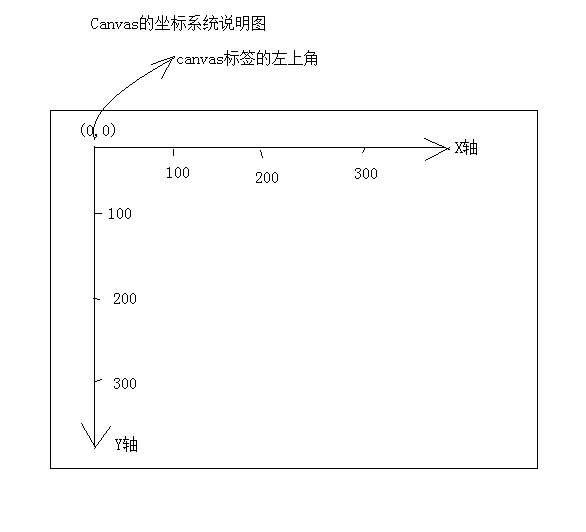
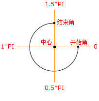
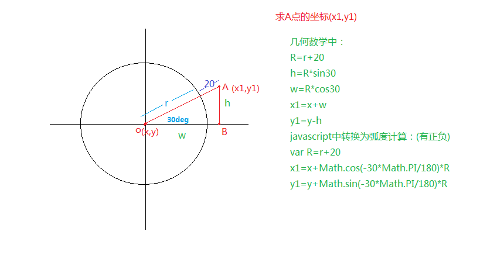

#一、canvas简介

##1、1什么是canvas？
+ html5提供的新标签，IE9以上才支持该标签

```
    <canvas></canvas>

```

+ canvas是一个矩形的画布，可以用JS在上面绘画，能精确到一个像素
+ canvas本身不具备绘图功能
+ canvas拥有多种绘制路径、矩形、圆形、字符以及添加图像方法
+ HTML5之前的web页面只用一些固定样式的标签：比如div、p、等

##1、2canvas的应用领域
+ 1、游戏：canvas在基于Web的图像显示方面比Flash更加立体、更加精巧，canvas游戏在流畅度和跨平台方面更牛。 
+ 2、可视化数据，数据图表，如：[百度echarts](http://echarts.baidu.com/)
+ 3、广告：Flash曾经辉煌的时代，智能手机还未曾出现。现在以及未来的智能机时代，HTML5技术能够在banner广告上发挥巨大作用，用Canvas实现动态的广告效果再合适不过。
+ 4、未来=> 模拟器：无论从视觉效果还是核心功能方面来说，模拟器产品可以完全由JavaScript来实现。
+ 5、未来=> 远程计算机控制：Canvas可以让开发者更好地实现基于Web的数据传输，构建一个完美的可视化控制界面。
+ 6、未来=> 图形编辑器：Photoshop图形编辑器将能够100%基于Web实现。
+ 7、其他可嵌入网站的内容(多用于活动页面、特效)：类似图表、音频、视频，还有许多元素能够更好地与Web融合，并且不需要任何插件。
+ 8、完整的canvas移动化应用

##1、3要求 
+ 必须会做基本的用canvas绘制的特效页面
+ 会用canvas做一些简单的广告、活动页面

##1、4canvas标准
+ 最新标准：http://www.w3.org/TR/2dcontext/
+ 稳定版本的标准：http://www.w3.org/TR/2013/CR-2dcontext-20130806/
+ 目前来说，标准还在完善中。先用早期的api足够完成所有的应用

#二 canvas绘图基础
##2、1 canvas标签语法和属性
+ 标签名canvas，需要进行闭合。就是一普通的html标签
+ 可以设置width和height属性，但是属性值单位必须是px，否则忽略
+ width和hegiht：默认300*150像素
+ 注意：
 + 不要用CSS控制它的宽和高,会走出图片拉伸，
 + 重新设置canvas标签的宽高属性会让画布擦除所有的内容
 + 可以给canvas画布设置背景色

##2、2 浏览器不兼容**
+ ie9以上才支持canvas, 其他chrome、ff、苹果浏览器等都支持
+ 只要浏览器兼容canvas，那么就会支持绝大部分api(个别最新api除外)
+ 移动端的兼容情况非常理想，基本上随便使用
+ 2d的支持的都非常好，3d（webgl）ie11才支持，其他都支持
+ 如果浏览器不兼容，最好进行友好***提示***
+ 浏览器不兼容，可以使用flash等手段进行***优雅降级***

###2、3 canvas的上下文context***
+ 上下文：上知天文，下知地理。是所有的绘制操作api的入口或者集合
+ Canvas自身无法绘制任何内容。Canvas的绘图是使用JavaScript操作的
+ Context对象就是JavaScript操作Canvas的接口。 *使用[CanvasElement].getContext(‘2d’)来获取2D绘图上下文

```javascript
	
	//获得画布
	var canvas  = document.getElementById( 'cavsElem' ); 
	var ctx = canvas.getContext( '2d' );//注意：2d小写
	
```
###2、4 canvas基本的绘制路径***
####2、4、1 canvas坐标系


####2、4、2  设置绘制起点moveTo(x,y)
+ 语法：ctx.moveTo(x, y);
+ 解释：设置上下文绘制路径的起点。相当于移动画笔到某个位置
+ 参数：x,y 都是相对于 canvas盒子的最左上角
+ 注意：**绘制线段前必须先设置起点，不然绘制无效。**

####2、4、3  绘制直线lineTo
+ 语法：ctx.lineTo(x, y);
+ 解释：从x,y的位置绘制一条直线到起点或者上一个线头点
+ 参数：x,y 线头点坐标
+ 绘制五子棋棋盘如：demo02.html
+ 绘制简单的折线图表如：demo03.html

####2、4、4 路径的开始和闭合
+ 开始路径：ctx.beginPath();
+ 闭合路径：ctx.closePath();
+ 解释：如果复杂路径绘制，必须使用路径开始和结束。闭合路径会自动把最后的线头和开始的线头连在一起
+ beginPath: 核心的作用是将 不同绘制的形状进行隔离，每次执行此方法，表示重新绘制一个路径,跟之前的绘制的墨迹可以进行分开样式设置和管理

#### 2、4、5  描边stroke()
+ 语法：ctx.stroke();
+ 解释：根据路径绘制线。路径只是草稿，真正绘制线必须执行stroke

#### 2、4、6  绘制的基本步骤
+ 第一步获得canvas元素=>canvasElem=document.getElementById('cavsElem');或者其他API
+ 第二步：获得上下文 =>canvasElem.getContext('2d');
+ 第三步：开始路径规划 =>ctx.beginPath()
+ 第四步：移动起始点 =>ctx.moveTo(x, y)
+ 第五步：绘制线(矩形、圆形、图片...) =>ctx.lineTo(x, y)
+ 第六步：闭合路径 =>ctx.closePath();
+ 第七步：绘制描边 =>ctx.stroke();

```
    html部分：
        <canvas id="cavsElem">
            你的浏览器不支持canvas，请升级浏览器
        </canvas>

    javascript部分：

    //===============基本绘制api====================
    //获得画布
    var canvas = document.querySelector('#cavsElem');
    var ctx = canvas.getContext('2d');  //获得上下文

    canvas.width = 900;     //设置标签的属性宽高
    canvas.height = 600;    //千万不要用 canvas.style.height
    canvas.style.border = "1px solid #000";

    //绘制三角形
    ctx.beginPath();        //开始路径
    ctx.moveTo(100,100);    //三角形，左顶点
    ctx.lineTo(300, 100);   //右顶点
    ctx.lineTo(300, 300);   //底部的点
    ctx.closePath();        //结束路径
    ctx.stroke();           //描边路径
```
####  2、4、7 填充 fill()
+ 语法：ctx.fill(); 
+ 解释：填充，是将闭合的路径的内容填充具体的颜色。默认黑色。
+ 如demo01.html

####  2、4、8 快速创建矩形的方法rect()
+ 语法：ctx.rect(x, y, width, height);
+ 解释：x, y是矩形左上角坐标， width和height都是以像素计
+ rect方法只是规划了矩形的路径，并没有填充和描边。
+ 如demo05.html

#### 2、4、9 快速创建描边矩形和填充矩形strokeRect()
+ 语法： ctx.strokeRect(x, y, width, height);
+ 语法：ctx.fillRect(x, y, width, height);
+ 如demo05.html

#### 2、4、10清除矩形 clearRect()
+ 语法：ctx.clearRect(x, y, width, hegiht);
+ 解释：清除某个矩形内的绘制的内容，相当于橡皮擦
+ 如demo05.html

###2、5 绘制圆形arc(),arc() 方法创建弧/曲线（用于创建圆或部分圆）
+ 语法：ctx.arc(x,y,r,sAngle,eAngle,counterclockwise);
+ x,y：圆心坐标
+ r：半径大小
+ sAngle:绘制开始的角度。 圆心到最右边点是0度，顺时针方向弧度增大
+ eAngel:结束的角度，注意是弧度。π
+ counterclockwise：是否是逆时针。true是逆时针，false：顺时针
+ 弧度和角度的转换公式： rad = deg*Math.PI/180;如：45度=45*Math.PI/180
+ 在Math提供的方法中sin、cos等都使用的弧度 

+ 绘制弧形如：demo06.html
+ 绘制饼状图如：demo07.html

###2、5、1 javascript中的数学计算Math.sin(弧度)和Math.cos(弧度)
+ 几何数学中是实际的度数
+ JS中是需要转换为弧度去计算，
+ 例：求下图中A点的坐标，已知A点距离原点的距离：r+20,以及A点与水平线的夹角为30度，canvas中水平线网上为负的度数


### 2、6 绘制文字

sin48=x/y,x=sin48*y